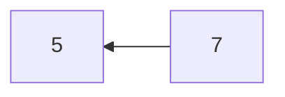
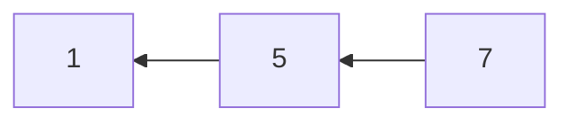
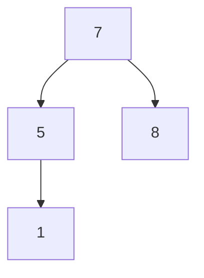
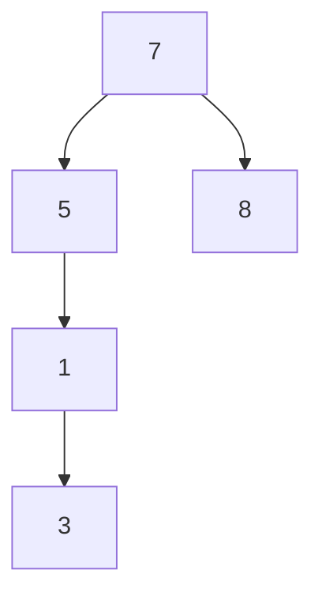
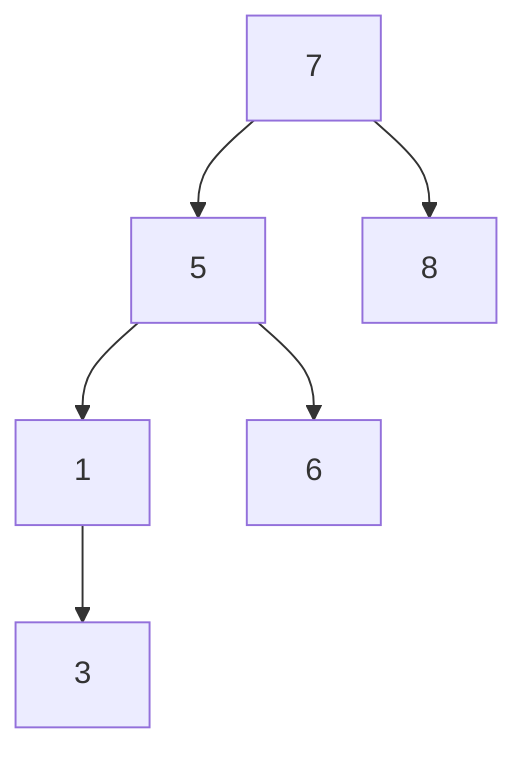
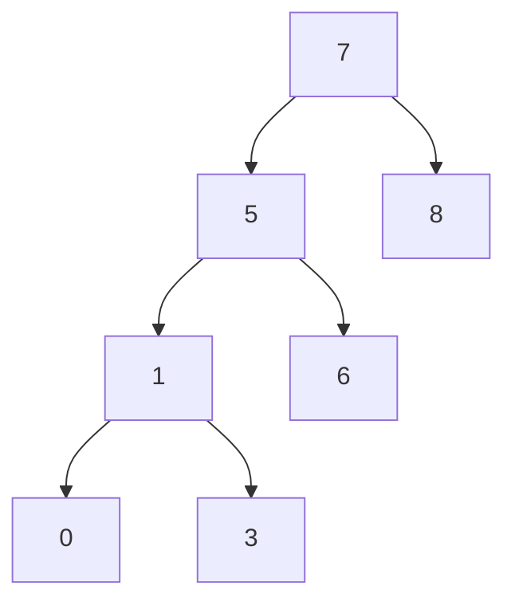
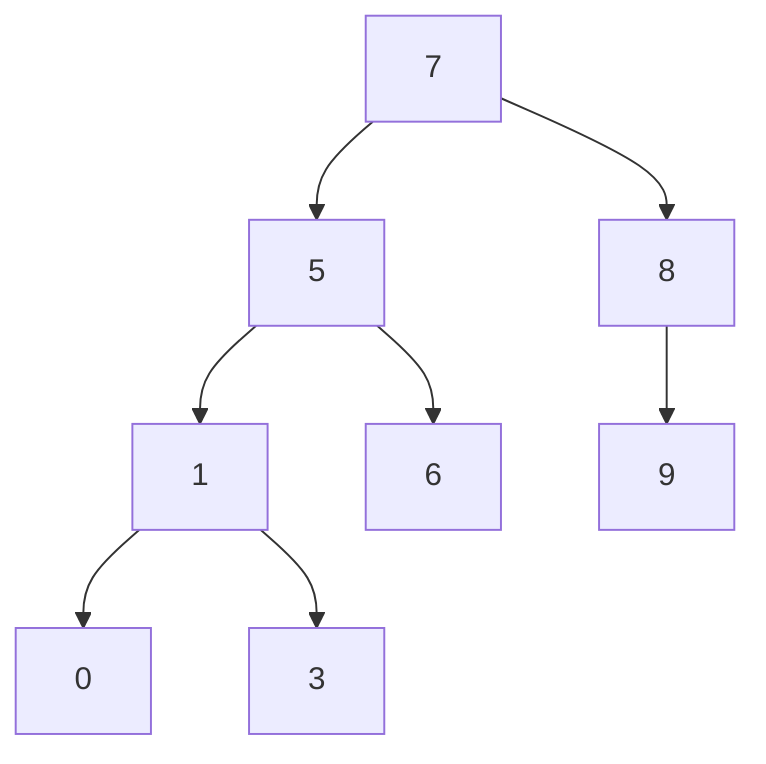
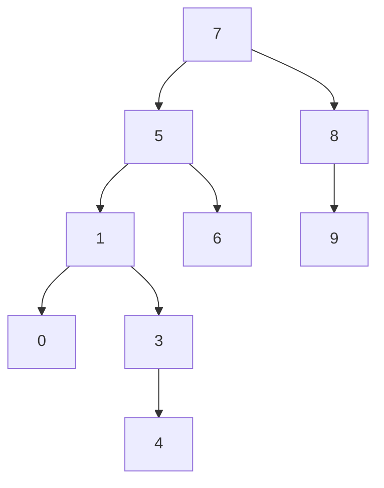
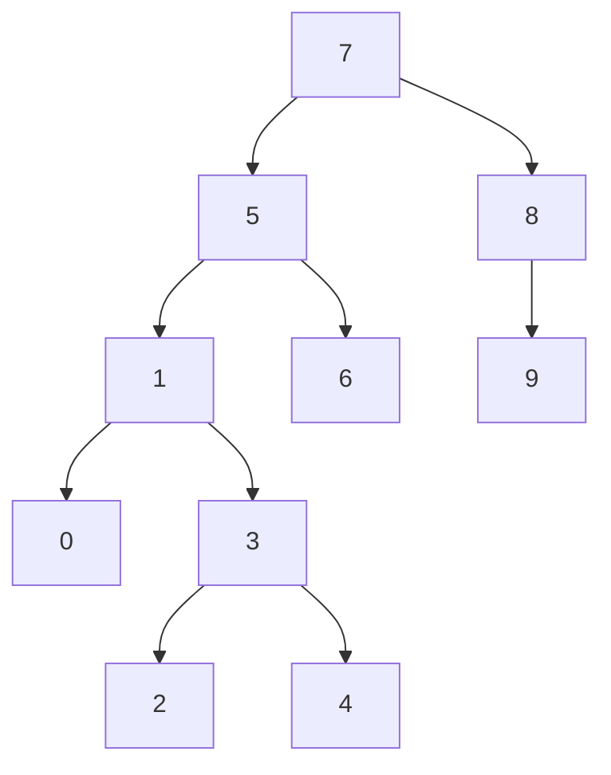

## PROJE 3
#### **[7, 5, 1, 8, 3, 6, 0, 9, 4, 2] dizisinin Binary Search Tree aşamalarını yazınız.**

###### ***Bir düğüm her iki tarafa da referans verebiliyor. Sağ ve sol olarak. Sağ tarafından kendinden büyük elemanlar, sol tarafında ise kendinden küçük elemanlar bulunacak.***

##### **Tree'ye eleman eklemek istediğimde root'dan başlıyorum.**
#### root = 7
##### ***Tepeye 7'yi koyuyoruz ve daha sonra dizideki 2. veriye yani 5 sayısına bakıyoruz. 5, 7'den küçüktür ve 7'nin sol tarafına ekleriz. Daha sonra sıra 1'e gelir ve 1 de 7'den küçüktür. Aynı zamanda 5'ten de küçük olduğu için 5'in sol tarafına yazarız. Aynı şekilde 8 için de bir kıyaslama yaparsak eğer 8 sayısı 7'den büyüktür ve bu yüzden 7'nin sağ tarafına yazılır. 3 sayısı 7'den ve 5'ten küçüktür o halde 5'in solunda bulunan 1'e göre kıyaslama yaparız. Bu durumda ise 3, 1'den büyük olduğu için 1'in sağına yazılır. Tüm sayıları bu şekilde değerlendirerek ağacımızı oluştururuz.***

1. Aşama

2. Aşama

3. Aşama

4. Aşama

5. Aşama

6. Aşama

7. Aşama

8. Aşama

Son Hali

